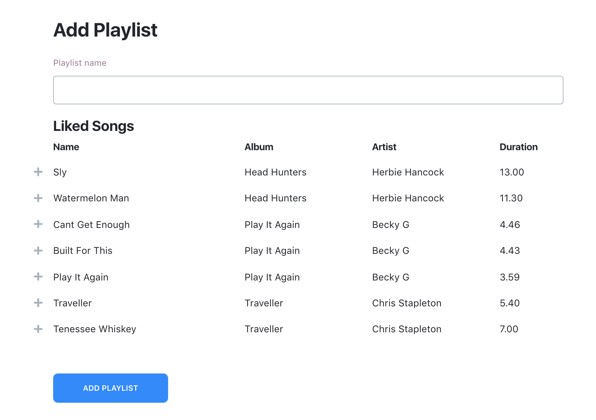
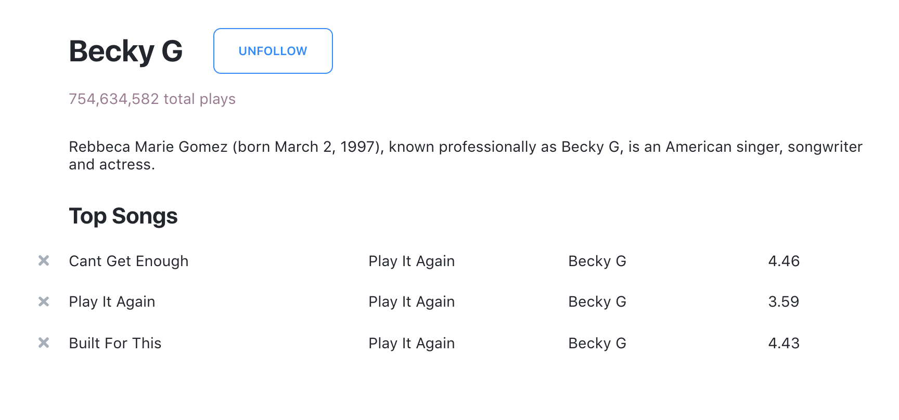
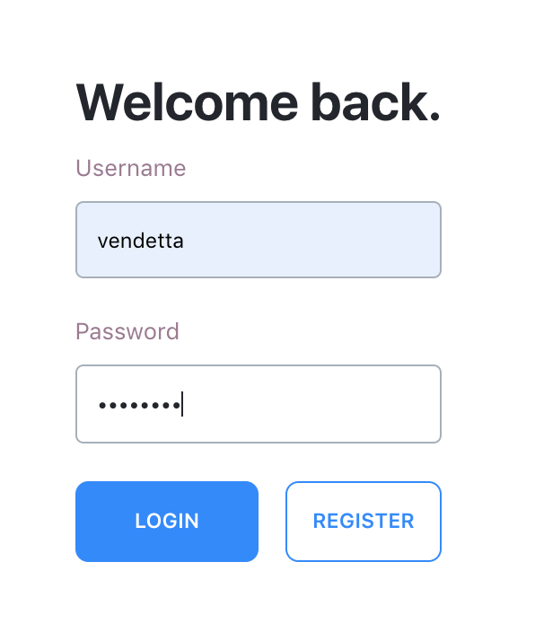

# Brief

This project is a small web application that allows users to stream and manage music. It was built for the final assignment of CPSC 304 with a group of two other students.

## Features

### Like Songs and Create Playlists

The user can like songs and create new playlists as they wish. When they make a new playlist they can choose songs they wish to add to the playlist from their liked songs.

### Read and Follow Artists

The user can read detailed information about an artist such as their bio and their most popular songs. The user can also choose to follow or unfollow artists.

### Authentication

The app supports very simple plain-text authentication to differentiate between users.